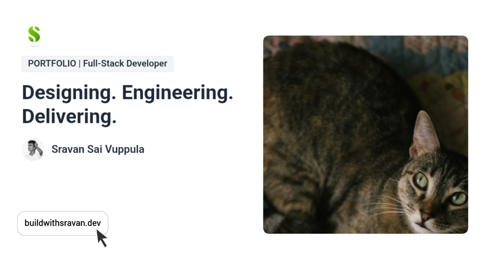

# Sravan Sai Vuppula Portfolio

> Official portfolio of **Sravan Sai Vuppula** — Full-Stack Developer, Founder of LYFSpot, and Software Engineer passionate about building scalable digital products.



---

## Live Website

🌐 https://buildwithsravan.dev

---

## About

This portfolio showcases my work, experience, projects, certifications, resume, and technical skills.

It is designed with a strong focus on:

- Modern UI/UX
- Performance
- Accessibility
- SEO
- Responsive Design
- Professional Branding

---

## Tech Stack

### Frontend

- React 19
- TypeScript
- TanStack Start
- TanStack Router
- Vite
- Tailwind CSS
- Framer Motion

### UI

- Radix UI
- Lucide Icons

### Deployment

- Cloudflare Pages
- Cloudflare DNS
- Cloudflare SSL

### SEO

- Open Graph
- Twitter Cards
- JSON-LD Structured Data
- Sitemap
- Robots.txt
- Google Search Console
- Bing Webmaster Tools

---

## Features

- Responsive Design
- Resume Viewer
- Interactive Project Showcase
- Professional Timeline
- Modern Animations
- SEO Optimized
- Open Graph Preview
- Custom Domain
- Progressive Web App Support
- Cloudflare Analytics

---

## Lighthouse

| Category | Score |
|-----------|------:|
| Performance | 56+ *(Improving)* |
| Accessibility | 96 |
| Best Practices | 100 |
| SEO | 100 |

---

## Repository

Clone

```bash
git clone https://github.com/sravansai-26/sravan_portfolio.git
```

Install

```bash
npm install
```

Run

```bash
npm run dev
```

Build

```bash
npm run build
```

---

## Connect

Website

https://buildwithsravan.dev

GitHub

https://github.com/sravansai-26

LinkedIn

https://www.linkedin.com/in/sravan-sai-vuppula-753b711ba

Medium

https://medium.com/@sravansaivuppula

Email

sai1234comon@gmail.com

---

© 2026 Sravan Sai Vuppula.
All Rights Reserved.
